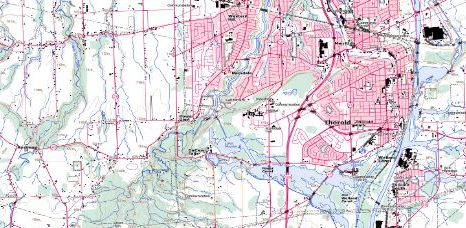

# How to find and download topographic maps of Canada

### Part A: Finding the map sheet of interest

1. Go to TOPORAMA https://atlas.gc.ca/toporama/en/index.html

2. In the search bar, enter "Niagara". The map zooms to the Niagara area.

3. Zoom in and out using the mouse scroll wheel. To pan the map, click and drag.

4. Click the red target beside "Get coordinates from map".

5. Click the map to see a pop-up of information including Geographic Coordinates, UTM
Coordinates, NTS Map sheet, UTM Elevation and Magnetic declination. 

> **Note the NTS map sheet number and name (i.e. 030M03 - NIAGARA)**

### Part B: Downloading maps and data

1. Expand the Toporama menu and click on the “Downloaded Maps and Data”

2. Click under Raster Maps “Get all maps for all of Canada”. This will bring you to the Open Government Portal web page. 

3. Search for "Digital Topographic Raster Maps"

> Alternately, go to: 
> https://open.canada.ca/data/en/dataset/d248b5be-5887-4cfb-942f-d425d82e6ea9

> Explore the options for download, or click here for Print-ready PDF files https://open.canada.ca/data/en/dataset/d248b5be-5887-4cfb-942f-d425d82e6ea9/resource/9ca5525b-8527-40ec-9711-a2d744cf1ec0

4. Click the URL to access the FTP directory for download. The number of the map is 030M03. 

5. Click on the folder labeled 50k. 

6. Locate the folder with "030" and click it.

7. Find the folder with "m" and click it.

8. Rest the cursor over each file to see the filename and make an appropriate selection. For example, a filename ending with "prtrdy" will download a print ready PDF.

 
 
 ---

  
**This tutorial is brought to you by the [Brock University Map, Data & GIS Library](https://brocku.ca/library/mdgl/)  E-mail us at maplib@brocku.ca **  
  
You can also find us on:  
[Facebook](https://www.facebook.com/Brock-University-Map-Data-GIS-Library-107927255178257)  
[Twitter](https://twitter.com/BrockU_MDGL) 
[Instagram](https://www.instagram.com/brockmdgl/)  
 

<!--- Please use reference style images so that it is easier to update pictures later --->

